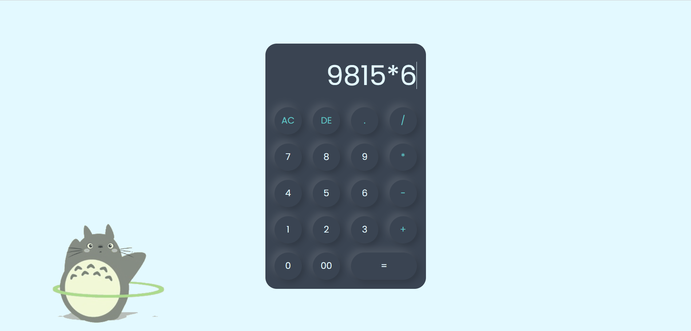

# Simple-Calculator
A simple calculator built using HTML, CSS, and JavaScript. This project is a basic implementation of a calculator with standard arithmetic operations and a neat user interface.

## Features

- **Basic Operations**: Addition, subtraction, multiplication, and division.
- **Clear (AC) and Delete (DE)**: Buttons to clear the entire input or delete the last character.
- **Responsive Design**: Adapts to different screen sizes.
- **Keyboard Support**: Use keyboard to enter numbers and operators.
  
## Demo

Check out the live demo [here](https://sumo90.github.io/Simple-Calculator) 

## Screenshot

 

## Technologies Used

- **HTML5**: Markup for creating the structure of the calculator.
- **CSS3**: Styling for a modern and responsive UI.
